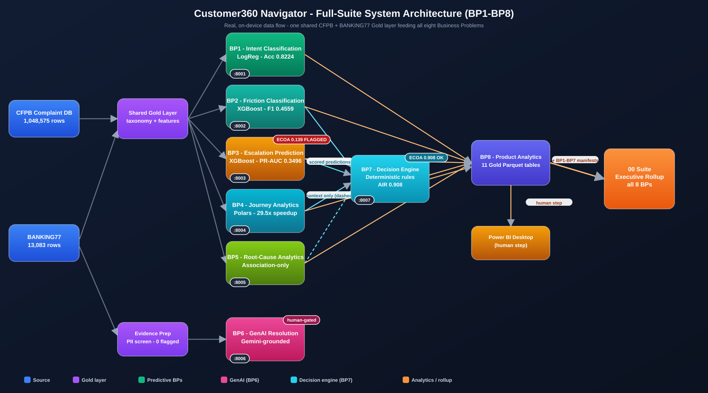

<div align="center">

# 🧭 Customer360 Navigator
### Enterprise Complaint, Friction & Journey Intelligence Suite

**Eight real business problems. One shared CFPB dataset. Zero fabricated numbers — including the one time the fairness audit didn't come back clean.**

[](https://github.com/rnanda19/Customer360_Navigator_Enterprise_Suite/actions/workflows/ci.yml)
[](https://github.com/rnanda19/Customer360_Navigator_Enterprise_Suite/actions/workflows/code-quality.yml)
[](https://github.com/rnanda19/Customer360_Navigator_Enterprise_Suite/actions/workflows/codeql.yml)
[](https://github.com/rnanda19/Customer360_Navigator_Enterprise_Suite/actions/workflows/docker-verify.yml)
[](https://github.com/rnanda19/Customer360_Navigator_Enterprise_Suite/actions/workflows/vault-verify.yml)
[]()
[](#methodology)
[](LICENSE)
[](#execution-boundary-standing-rule-disclosed-on-purpose)
[](#business-problems)

**[🗺️ Start here](#start-here-live-suite-dashboard)** · **[⚡ Why it's different](#why-this-repo-is-different)** · **[📊 Real headline results](#at-a-glance)** · **[📈 Live reports](#live-reports-and-dashboards)** · **[⚠️ The fairness finding](#leading-with-the-fairness-finding)** · **[🧭 Business problems](#business-problems)** · **[🏗️ Architecture](#system-architecture)** · **[🗂️ Structure](#structure)** · **[🚀 Quickstart](#reproducing-this-locally)** · **[📌 What this is / isn't](#execution-boundary-standing-rule-disclosed-on-purpose)**

</div>

<br>

Enterprise AI-driven customer complaint, friction, and journey intelligence platform built on the real CFPB
Consumer Complaint Database (1,048,575 rows) and Banking77 (13,083 rows). Independent professional
portfolio project. Not affiliated with Capital One, PolyAI, or any financial institution.

<br>

## Start Here: Live Suite Dashboard

**[View the live Suite Dashboard](https://rnanda19.github.io/Customer360_Navigator_Enterprise_Suite/reports/00_suite_executive_rollup/00_suite_executive_rollup_dashboard.html)** -
the 00 Suite Executive Rollup comprehends all 8 Business Problems in one place: real headline
metrics, each BP's production tier, and the disclosed fairness finding. Start here for the
clearest roadmap through the whole platform - every other dashboard below is one click away from
it too.

<p align="center">
  
</p>

<p align="center"><sub>Full-suite architecture, real data flow only - no illustrative boxes. Deep-dive version (shared-infrastructure table, cross-cutting governance matrix, per-BP status): <a href="docs/architecture/README.md">docs/architecture/README.md</a>.</sub></p>

<br>

## Why this repo is different

Most complaint-analytics portfolios stop at a confusion matrix and a clean-looking accuracy number. This one doesn't.

**A real fairness finding is disclosed, not buried.** BP3's complaint-escalation model came back with a real disparate-impact ratio of 0.139 on a protected-class-adjacent field — flagged against the regulatory four-fifths-rule floor of 0.80. Two rounds of fairness-aware retraining were built, real-run, and **rejected** because the real evidence showed they cost accuracy without closing the gap. The original model ships unchanged, the finding ships in the README, not hidden in an appendix.

**Every "real-run confirmed" claim is independently re-verified, not self-reported.** Every gate result in this repo was cross-checked against the actual on-disk artifact file (hash-verified) or the owner's own pasted console output before being called real — the same discipline applied to every one of the 8 business problems, not just the headline ones.

**No GenAI output is ever auto-applied.** BP6's resolution assistant makes a real, grounded call to Google Gemini, cites its real evidence IDs — and every single recommendation routes to `PENDING_HUMAN_REVIEW` before use. There is no code path that skips the human.

**The deployment-readiness verdict audits the filesystem, not a status flag.** Each business problem's `*_readiness_verdict.py` module recomputes SHA-256 hashes, reloads the persisted model, and re-runs the test suite as a subprocess — it never trusts a config file's own claim that something is done.

<br>

## At a glance

| Business problem | Champion / method | Headline metric | Status |
|---|---|---|---|
| BP1 — Customer Intent Classification | Logistic regression (77-class) | Accuracy **0.8224**, ROC-AUC **0.9933** | MEASURED — RECOMMENDED FOR PRODUCTION |
| BP2 — Customer Friction Classification | XGBoost | F1-macro **0.4559** (152:1 real class imbalance) | MEASURED — RECOMMENDED FOR PRODUCTION |
| BP3 — Complaint Escalation Prediction | XGBoost | PR-AUC **0.3496**, recall **0.9424** | MEASURED — CONDITIONAL, disparate-impact disclosed |
| BP4 — Customer Journey / Cluster Analytics | Polars/DuckDB lazy pipeline | **29.5x** speedup, 37,160 real clusters | MEASURED — RECOMMENDED FOR PRODUCTION |
| BP5 — Root-Cause & Driver Analytics | Association study (Cramér's V, log-odds) | Association-only, never causal | MEASURED — Decision-support, with monitoring |
| BP6 — GenAI Resolution Assistant | Retrieval + Gemini-grounded generation | Retrieval coverage **0.333**, 0 PII flagged | MEASURED — RECOMMENDED FOR PRODUCTION, human-gated |
| BP7 — Customer Navigator Decision Engine | Deterministic weighted-rule engine | Adverse impact ratio **0.908** (not flagged) | MEASURED — RECOMMENDED FOR PRODUCTION |
| BP8 — Executive/Product Analytics | Power BI Gold-layer aggregation | **11** real Gold Parquet tables | MEASURED — build complete, all 3 gates confirmed |

Suite-wide: **1,048,575** real CFPB rows, **13,083** real Banking77 rows, **1,000+** tests across the suite, **0** fabricated figures. Full detail, per BP, in `notebooks/<bp>/README.md` and `reports/<bp>/README.md`.

<br>

## Live Reports and Dashboards

Every executive rollup below is a real file committed in this repo - not a mockup, not a template with
numbers dropped in. Click **View live** to open the interactive HTML dashboard directly in your browser,
served through **GitHub Pages** - this repo's own committed files, served as plain static assets so the
real Plotly / inline-JS charts in each dashboard actually draw (an earlier version of these links routed
through htmlpreview.github.io, which strips JavaScript entirely for security and left every chart blank -
switched away from it for that reason).

**One-time setup required:** these links only resolve once GitHub Pages is turned on for this repo -
Settings -> Pages -> Source: "Deploy from a branch" -> Branch: `main`, folder `/ (root)` -> Save. Until
that's done, the links below 404; nothing else in this repo depends on it. Report / Workbook / Deck open
GitHub's own built-in file previewer.

| Business problem | Dashboard | Report (.docx) | Workbook (.xlsx) | Deck (.pptx) |
|---|---|---|---|---|
| **00 - Suite-wide rollup (start here)** | [View live](https://rnanda19.github.io/Customer360_Navigator_Enterprise_Suite/reports/00_suite_executive_rollup/00_suite_executive_rollup_dashboard.html) | [Report](reports/00_suite_executive_rollup/00_suite_executive_rollup_report.docx) | [Workbook](reports/00_suite_executive_rollup/00_suite_executive_rollup_workbook.xlsx) | [Deck](reports/00_suite_executive_rollup/00_suite_executive_rollup_deck.pptx) |
| BP1 - Customer Intent Classification | [View live](https://rnanda19.github.io/Customer360_Navigator_Enterprise_Suite/reports/bp1_customer_intent_classification/executive_rollup/bp1_executive_rollup_dashboard.html) | [Report](reports/bp1_customer_intent_classification/executive_rollup/bp1_executive_rollup_report.docx) | [Workbook](reports/bp1_customer_intent_classification/executive_rollup/bp1_executive_rollup_workbook.xlsx) | [Deck](reports/bp1_customer_intent_classification/executive_rollup/bp1_executive_rollup_deck.pptx) |
| BP2 - Customer Friction Classification | [View live](https://rnanda19.github.io/Customer360_Navigator_Enterprise_Suite/reports/bp2_customer_friction_classification/executive_rollup/bp2_executive_rollup_dashboard.html) | [Report](reports/bp2_customer_friction_classification/executive_rollup/bp2_executive_rollup_report.docx) | - | [Deck](reports/bp2_customer_friction_classification/executive_rollup/bp2_executive_rollup_deck.pptx) |
| BP3 - Complaint Escalation Prediction | [View live](https://rnanda19.github.io/Customer360_Navigator_Enterprise_Suite/reports/bp3_complaint_escalation_prediction/executive_rollup/bp3_executive_rollup_dashboard.html) | [Report](reports/bp3_complaint_escalation_prediction/executive_rollup/bp3_executive_rollup_report.docx) | - | [Deck](reports/bp3_complaint_escalation_prediction/executive_rollup/bp3_executive_rollup_deck.pptx) |
| BP4 - Customer Journey Analytics | [View live](https://rnanda19.github.io/Customer360_Navigator_Enterprise_Suite/reports/bp4_customer_journey_analytics/executive_rollup/bp4_executive_rollup_dashboard.html) | [Report](reports/bp4_customer_journey_analytics/executive_rollup/bp4_executive_rollup_report.docx) | [Workbook](reports/bp4_customer_journey_analytics/executive_rollup/bp4_executive_rollup_workbook.xlsx) | [Deck](reports/bp4_customer_journey_analytics/executive_rollup/bp4_executive_rollup_deck.pptx) |
| BP5 - Root-Cause and Driver Analytics | [View live](https://rnanda19.github.io/Customer360_Navigator_Enterprise_Suite/reports/bp5_root_cause_driver_analytics/executive_rollup/bp5_executive_rollup_dashboard.html) | [Report](reports/bp5_root_cause_driver_analytics/executive_rollup/bp5_executive_rollup_report.docx) | [Workbook](reports/bp5_root_cause_driver_analytics/executive_rollup/bp5_executive_rollup_workbook.xlsx) | [Deck](reports/bp5_root_cause_driver_analytics/executive_rollup/bp5_executive_rollup_deck.pptx) |
| BP6 - GenAI Resolution Assistant | [View live](https://rnanda19.github.io/Customer360_Navigator_Enterprise_Suite/reports/bp6_genai_resolution_assistant/executive_rollup/bp6_executive_rollup_dashboard.html) | [Report](reports/bp6_genai_resolution_assistant/executive_rollup/bp6_executive_rollup_report.docx) | [Workbook](reports/bp6_genai_resolution_assistant/executive_rollup/bp6_executive_rollup_workbook.xlsx) | [Deck](reports/bp6_genai_resolution_assistant/executive_rollup/bp6_executive_rollup_deck.pptx) |
| BP7 - Customer Navigator Decision Engine | [View live](https://rnanda19.github.io/Customer360_Navigator_Enterprise_Suite/reports/bp7_customer_navigator_decision_engine/executive_rollup/bp7_executive_rollup_dashboard.html) | [Report](reports/bp7_customer_navigator_decision_engine/executive_rollup/bp7_executive_rollup_report.docx) | [Workbook](reports/bp7_customer_navigator_decision_engine/executive_rollup/bp7_executive_rollup_workbook.xlsx) | [Deck](reports/bp7_customer_navigator_decision_engine/executive_rollup/bp7_executive_rollup_deck.pptx) |
| BP8 - Executive/Product Analytics | *Gold-layer build only, no dashboard - see [`powerbi/gold_tables/`](powerbi/gold_tables/) and [`reports/bp8_executive_product_analytics/README.md`](reports/bp8_executive_product_analytics/README.md)* | - | - | - |

BP2 and BP3 don't carry a standalone `.xlsx` workbook in their rollup - disclosed here rather than linking
a file that isn't there. Every other cell links a real, committed file.

<br>

## Leading with the fairness finding

The suite's decision layer (BP7) runs a live ECOA/Regulation B disparate-impact audit against its own
full-population output — not a one-off check, a re-derivation on every run, cross-checked against an
earlier gate's own independently-computed number. On the most recent real run: **adverse impact ratio
0.908127**, against the EEOC four-fifths-rule floor of 0.80 — the audit does **not** flag the model.
Lowest-selection-rate group: Servicemember. Highest: Older American. This isn't a claim of legal
compliance (the pipeline says so explicitly, in its own output) — it's a monitoring signal a human
reviewer can act on, computed the same honest way every time.

That audit exists because BP3 (Complaint Escalation Prediction), the first model upstream to touch a
protected-class-adjacent field, surfaced a real disparate-impact question early (ratio 0.139, flagged),
and every model built after it — BP4, BP5, BP7 — inherited the same check rather than dropping it once
the initial finding was resolved. BP3's own finding was investigated, not patched over: a proxy-feature
audit found no single trained feature explains it, and two fairness-aware retraining candidates were
built, real-run, and rejected on real evidence before the original model was confirmed as final. Full
investigation trail in `notebooks/bp3_complaint_escalation_prediction/README.md`.

<br>

## Business problems

Eight business problems, each with its own real trained model or rule layer, each gated through the same
6-stage governance cycle (Business Understanding → Data/Feature Verification → Model/Rule Benchmark →
Statistical Validation & Explainability → Decision Layer & Reporting → Productization/Monitoring/
Governance), each closing with an executive rollup (dashboard + report + workbook + deck) built from its
own real, live-computed numbers — never a template with numbers dropped in.

<details>
<summary><b>BP1 — Customer Intent Classification</b> (click to expand)</summary>

77-class Banking77 intent taxonomy, TF-IDF text features. Champion: logistic regression. Held-out test
accuracy **0.8224**, F1-macro **0.8221**, ROC-AUC (OVR macro) **0.9933**. All 6 gates + executive rollup
real-run confirmed. Details: [`notebooks/bp1_customer_intent_classification/README.md`](notebooks/bp1_customer_intent_classification/README.md).
</details>

<details>
<summary><b>BP2 — Customer Friction Classification</b> (click to expand)</summary>

4-class ordinal friction severity from structured CFPB fields. Champion: XGBoost, under a real 152:1 class
imbalance. Held-out F1-macro **0.4559**, accuracy **0.755773**. All 6 gates + executive rollup real-run
confirmed. Details: [`notebooks/bp2_customer_friction_classification/README.md`](notebooks/bp2_customer_friction_classification/README.md).
</details>

<details>
<summary><b>BP3 — Complaint Escalation / Intervention Prediction</b> (click to expand)</summary>

Binary intervention prediction. Champion: XGBoost. Held-out PR-AUC **0.3496**, recall **0.9424**. First BP
to carry a live ECOA/Reg B disparate-impact check — real finding (ratio 0.139, flagged), fully
investigated (proxy-feature audit + 2 fairness-aware retraining candidates, both real-run and rejected on
the evidence), final governance decision: accept and disclose. Details:
[`notebooks/bp3_complaint_escalation_prediction/README.md`](notebooks/bp3_complaint_escalation_prediction/README.md).
</details>

<details>
<summary><b>BP4 — Customer Journey / Issue-Cluster Analytics</b> (click to expand)</summary>

No customer identifier exists in the real CFPB schema, so this is explicitly event/issue journey
analytics, never invented longitudinal customer journeys. Champion aggregation engine: Polars
`lazy_streaming`, **29.5x** speedup over a pandas baseline. 37,160 real issue clusters, 41.85% recurring.
Details: [`notebooks/bp4_customer_journey_analytics/README.md`](notebooks/bp4_customer_journey_analytics/README.md).
</details>

<details>
<summary><b>BP5 — Root-Cause & Driver Analytics</b> (click to expand)</summary>

Association-only, never causal — every output is a disclosed statistical association (Cramér's V,
chi-square, closed-form log-odds ratio + Wald CI), cross-checked against `statsmodels`. Two real outcomes
studied. Details: [`notebooks/bp5_root_cause_driver_analytics/README.md`](notebooks/bp5_root_cause_driver_analytics/README.md).
</details>

<details>
<summary><b>BP6 — GenAI Resolution Assistant</b> (click to expand)</summary>

Retrieval-grounded generation over Banking77's real narrative text, with a live call to Google Gemini.
Every recommendation cites real evidence IDs and routes to `PENDING_HUMAN_REVIEW` before use — no
auto-apply code path exists. Details: [`notebooks/bp6_genai_resolution_assistant/README.md`](notebooks/bp6_genai_resolution_assistant/README.md).
</details>

<details>
<summary><b>BP7 — Customer Navigator Decision Engine</b> (click to expand)</summary>

This suite's Next-Best-Action layer: a deterministic, transparent weighted-rule policy
(`src/features/bp7_decision_engine_features.py::score_priority_rule`/`_recommended_action_expr`)
converting BP2/BP3/BP4's real predictions into one of four fixed business actions per complaint —
`ESCALATE_ROOT_CAUSE_REVIEW_RECURRING_CLUSTER`, `ESCALATE_SENIOR_REVIEWER`, `PRIORITY_QUEUE_REVIEW`,
`STANDARD_QUEUE` — plus a `priority_score` and reason codes, never a trained classifier and never a
GenAI call (by design — see the module's own docstring on why UDAAP Section 9 rules that out here).
Full-population real scoring (1,048,575 rows). Adverse impact ratio **0.908127** — passes the
four-fifths floor. Served live at `GET /decide/{complaint_id}` (`src/services/bp7_decision_engine_service.py`).
Details: [`notebooks/bp7_customer_navigator_decision_engine/README.md`](notebooks/bp7_customer_navigator_decision_engine/README.md).
</details>

<details>
<summary><b>BP8 — Executive/Product Analytics (Power BI Gold Layer)</b> (click to expand)</summary>

Aggregates Gold-layer outputs from BP1-7 into 11 real Power BI-ready Gold Parquet tables. No predictive
target, no classifier, no GenAI call — never treated as a ninth modeling problem. The interactive `.pbix`
is an explicit human, Power BI Desktop step. Details: [`notebooks/bp8_executive_product_analytics/README.md`](notebooks/bp8_executive_product_analytics/README.md).
</details>

A suite-wide executive rollup (`notebooks/00_suite_executive_rollup/`) consolidates all eight BPs' own real
findings into one dashboard/report/workbook/deck, cross-checking each BP's own recorded production tier
against its own artifact files rather than re-asserting it. Real-run confirmed: 5 of 8 BPs land at
RECOMMENDED FOR PRODUCTION, 1 at CONDITIONAL - GOVERNANCE REVIEW REQUIRED (BP3, disclosed above), 1 at
Recommended for Decision-Support Use With Monitoring (BP5); BP8 has no production-tier concept of its own
(a Gold-layer build, not a decision model).

<br>

## Two more things worth being upfront about

**BP7's flag rate.** The decision engine's `intervention_flag_rate` is 76.8% of the full population. That
number needs context, not a defense: `recommended_action` isn't binary. 75.2% of the population lands in
`ESCALATE_ROOT_CAUSE_REVIEW_RECURRING_CLUSTER` — routing to an automated recurring-cluster root-cause
process, not a per-complaint manual review — and only 1.6% lands in `PRIORITY_QUEUE_REVIEW`, the tier that
actually implies individual human attention. The flag rate is a direct, transparent function of a
data-driven champion weighting scheme (BP4's cluster-tier signal carries 60.65% of the combined score) and
a flat 0.5 threshold on that combined score — every number in that sentence is reproducible from the
pipeline's own output, not tuned after the fact to look good.

**A definitional overlap, not leakage.** A correlation check between BP2's and BP3's predictions on the
full population found a 1.0 escalation-positive rate inside BP2's `LOW_FRICTION` class (2,331 of 1,048,575
rows). That is not a leak: `LOW_FRICTION` and BP3's positive class are both defined on the identical real
CFPB outcome value ("Closed with monetary relief") for that subset — the two labels are tautologically the
same event for those specific rows, not a model finding a shortcut. This was named as an open question in
the decision engine's own Gate 1 planning document, quantified live at Gate 3 (Cramer's V 0.214 overall —
weak), and the resulting redundancy is already discounted in how the champion combines BP2 and BP3, rather
than being silently double-counted.

<br>

## System Architecture

This repo shows the full-suite architecture as **one diagram, in one place**: the vibrant SVG
right after the project description above, covering all 8 Business Problems end to end. This
section is kept only as a stable anchor for the nav bar above and as a pointer, deliberately not
a second, flatter re-drawing of the same picture that could drift out of sync with it.

For the fully-labeled deep-dive version of that same mechanism - plus the shared-infrastructure
table, the cross-cutting ECOA/Reg B / UDAAP / NIST AI RMF / GLBA governance matrix, and the
per-BP gate-by-gate status table - see [`docs/architecture/README.md`](docs/architecture/README.md).

<br>

## Structure

`notebooks/` — one folder per BP, one notebook per gate, each with a real README. `src/{taxonomy,features,
models,reporting,services,deployment,genai,utils}` — the shared component library, imported from BP1
onward: `taxonomy`/`features` are the data-preparation layer (raw CFPB/BANKING77 columns in,
engineered features out), `models` is the modeling layer (training + persistence), `deployment` +
`services` are the decisioning layer (readiness gates, the 7 live FastAPI services, and BP7's
deterministic Next-Best-Action rule engine — see [BP7](#bp7--customer-navigator-decision-engine)
below), and `reporting` is this suite's presentation layer (dashboards/reports/workbooks/decks —
there is no separate web frontend; BP8's Power BI layer plays that role, see Business problems
above). `configs/` — per-BP YAML, gate results appended as marker-delimited blocks. `reports/` —
MODEL_CARD.md, CHANGELOG.md, and each BP's executive rollup (dashboard/report/workbook/deck).
`powerbi/gold_tables/` — BP8's Python-built Gold/semantic layer (the interactive `.pbix` itself is a
human, Power BI Desktop step — never a notebook deliverable). `tests/` — 1,000+ tests, mirroring `src/`
1:1. `docs/` — architecture notes, BRD/FRD, data dictionary, and `evidence_ledger/EVIDENCE_LEDGER.md`,
the append-only record of every real run. `scripts/` — the notebook-syntax and structural-check tooling
every gate uses. `.github/workflows/` — 5 separate workflows, each its own real badge above:
`ci.yml` (pytest + notebook-syntax), `code-quality.yml` (lint: black/flake8/isort/ruff/mypy;
security: bandit), `codeql.yml` (GitHub-native semantic security scanning), `docker-verify.yml`
(real `docker build` + `docker run` + `/health` check for all 7 services), and
`vault-verify.yml` (real HashiCorp Vault dev-mode write/read/verify, see
`SECRETS_MANAGEMENT.md`) — plus `.github/dependabot.yml`, `.github/ISSUE_TEMPLATE/`, and
`.github/PULL_REQUEST_TEMPLATE.md`.
`docker-compose.yml` (repo root) — one-command aggregator of all 7 per-BP compose files under
`src/services/docker/`. `.env.example` — every real environment variable this codebase reads
(`C360_PROJECT_ROOT`, `C360_API_KEY`, `GEMINI_API_KEY`, `GEMINI_MODEL`), nothing illustrative.

<br>

## Reproducing this locally

```bash
python -m pip install -e .          # editable install of src/ (setuptools src-layout)
python -m pip install -r requirements.txt
jupyter lab                          # or notebook — run notebooks in gate order, G1 through G6/G7
```

A root `docker-compose.yml` builds and runs all 7 FastAPI services (BP1-BP7; BP8 has no service, see Structure below) together — `docker compose up --build`. Copy `.env.example` to `.env` first and set `C360_API_KEY` (all 7 services require it — see [SECURITY.md](SECURITY.md#authentication-added-2026-09-26); `/` and `/health` stay open with no key) — also set a real `GEMINI_API_KEY` if you're bringing up BP6.

Each notebook resolves its own project root (env override, else a bounded upward walk for a directory
containing both `configs/` and `src/`) rather than assuming a fixed path. `pytest tests/ -v` runs the full
suite (1,000+ tests across BP1-8, services, and deployment-readiness modules). Docker Compose files for
each BP's inference/decision service live under `src/services/docker/` — built and validated in CI, never
run behind a live public endpoint (see [Execution boundary](#execution-boundary-standing-rule-disclosed-on-purpose)
below).

<br>

## Execution boundary (standing rule, disclosed on purpose)

Every notebook here is generated by an AI assistant (Claude) but **executed only by the project owner, on
their own machine**. No claim in this repository's reports comes from a simulated or assistant-run
pipeline — every metric, chart, and verdict is produced by a real run the owner triggered and independently
verified, logged in the Evidence Ledger with file hashes. This boundary is enforced as a standing rule, not
an informal habit.

This also isn't a live production deployment. Every BP's FastAPI service (BP1-7) is real, Dockerized, and
covered by real tests (including end-to-end `TestClient` runs against the actual persisted model bundle),
and every Docker Compose file is CI-validated — but none of them has ever been run behind a live public
endpoint. That's an honest, disclosed gap, not an implied claim.

<br>

## Methodology

This suite's 6-gate governance cycle ([Business problems](#business-problems), above) is a concrete
implementation of three named, industry-standard delivery frameworks — made explicit here so the
suite is auditable against those frameworks, not just an internal checklist. Full detail:
[`docs/master_plan/Customer360_Navigator_Master_Execution_Plan_v2.docx`](docs/master_plan/Customer360_Navigator_Master_Execution_Plan_v2.docx),
Section 10.

**CRISP-DM.** Each gate is one CRISP-DM phase: Gate 1 (Business Understanding & Policy) → *Business
Understanding*; Gate 2's first half (real column-by-column CFPB/BANKING77 verification before any
code is written) → *Data Understanding*; Gate 2's second half (vectorized taxonomy mapping and
feature engineering in the shared `src/features/` module) → *Data Preparation*; Gate 3
(classifier/model benchmark, champion selection by mean CV metric) → *Modeling*; Gate 4 (bootstrap
CI, calibration, confusion matrix, explainability) → *Evaluation*; Gates 5–6 (decision/GenAI layer +
Power BI packaging, then production packaging & governance) → *Deployment*.

**SMART.** Every business problem's objective is Specific, Measurable, Achievable, Relevant and
Time-bound — e.g. BP1/BP2: classify real CFPB complaints into BANKING77-mapped intents and a
documented friction taxonomy, measured by F1/precision/recall/confusion matrix on a held-out real
split; achievable from the confirmed CFPB + BANKING77 schemas; relevant as the foundation every
downstream BP consumes; time-bound to its sprint (Master Plan Section 10.2 has the per-BP-cluster
breakdown). The same discipline also drives a real, generated feature of this suite: every BP's
executive rollup (dashboard + report + workbook + deck) includes data-grounded "SMART Suggestions" —
see `src/reporting/bp1_rollup_helpers.py` through `bp7_rollup_helpers.py` and
`suite_rollup_helpers.py` — never a templated recommendation dropped in after the fact.

**WARP.** The standing runtime-performance discipline applied throughout this suite's own build:
vectorization and zero-copy I/O (Polars over Python-level row loops), `category`/`float32` dtypes,
Parquet over CSV for any reused data, Numba `@njit(parallel=True)` for a loop that genuinely can't
be vectorized, resource ceilings capped at 92% RAM / 95% CPU — never 100% (a hard safety ceiling: a
full-utilization run has hung a machine before, so this is enforced as a cap, never an aspirational
target) — and reused thread/process pools with `psutil` core-affinity pinning. Extended with
NLP-specific levers this suite needed for the first time: batched inference through every classifier
and the GenAI assistant, `nlp.pipe` for spaCy, fast Rust-backed tokenizers, and embedding caching
keyed by complaint ID + model-version hash. Real numbers and the actual ceilings: `BENCHMARKS.md`,
`configs/resource_limits.yaml`, `src/utils/performance_setup.py`.

Also standing throughout this build: zero-fabrication and the execution boundary above, plus the
Evidence Ledger tracking every real, verified run. See `ROADMAP.md` for the build history and
`BENCHMARKS.md` for real hardware/runtime numbers.
</content>
