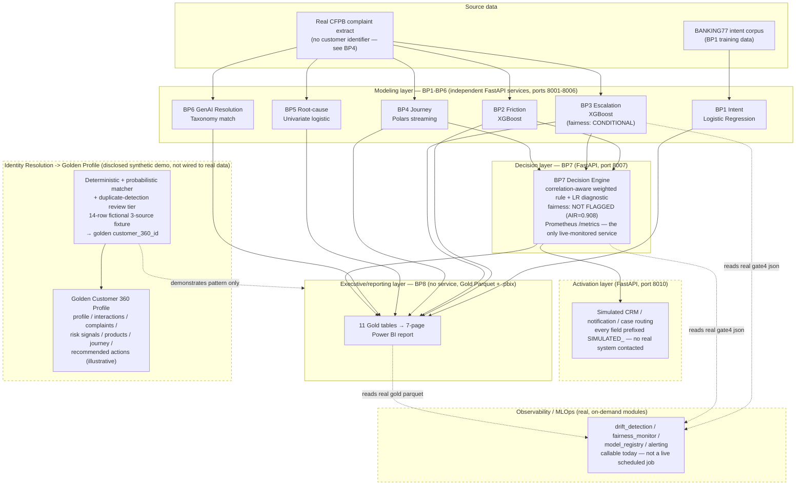

# Executive Architecture Summary

One page, for a time-constrained reader. Every box below is real and shipped in this repo; the
[Production Readiness Matrix](../PRODUCTION_READINESS_MATRIX.md) has the per-BP evidence behind each
one, and the dashed pieces are explicitly labeled as synthetic/simulated where they are.

## What's real vs. what's a disclosed pattern demo

| Layer | Status | Evidence |
|---|---|---|
| BP1–BP7 models, APIs, tests | **Real** — trained, tested, containerized | 1,663 passing tests across BP1-7; see matrix |
| BP7 fairness audit & Prometheus metrics | **Real and live-scored** | `adverse_impact_ratio=0.908127`; real `prometheus_client` instrumentation |
| BP8 Gold layer + `.pbix` | **Real** — 11 Parquet tables, committed 7-page report | [`powerbi/README.md`](../../powerbi/README.md) |
| Activation layer | **Real code, simulated destinations** — routes BP7's real decisions to mock CRM/notification/case adapters | Every response field prefixed `SIMULATED_`; disclosed in module docstring |
| Identity Resolution / Golden Customer Record | **Real code, synthetic fixture** — deterministic + fuzzy matching, match confidence, a duplicate-detection review tier, survivorship rules, and source lineage; demonstrates the pattern; never touches real CFPB rows because the real extract has no customer identifier to resolve | [`data/synthetic_identity_demo/README.md`](../../data/synthetic_identity_demo/README.md) |
| Golden Customer 360 Profile | **Real code, synthetic fixture** — assembles real risk-signal computation and a real merged journey timeline from the resolved golden records; the recommended action per profile is an explicitly illustrative demo rule reusing BP7's real action vocabulary, not BP7's trained decision engine | [`data/synthetic_identity_demo/customer_360_profile/README.md`](../../data/synthetic_identity_demo/customer_360_profile/README.md) |
| Observability / MLOps (drift, fairness, model registry, alerting) | **Real, tested, on-demand** — 23 passing pytest cases; not a live scheduled job, not wired to a live alert channel, and no MLflow-style tracking server / approval workflow / rollback pipeline is built | [`MLOPS_OBSERVABILITY.md`](../../MLOPS_OBSERVABILITY.md) |
| Live production deployment (HTTPS front door, auth gateway) | **Not done** — a real Render Blueprint (`render.yaml`) and "Deploy to Render" button are ready, but creating the account and approving the deploy is a real action only you can take | See `RENDER_DEPLOYMENT.md` and the button in README.md's BP7 section |
| Prometheus/Grafana live scraping | **Not done** — nothing is deployed yet for Grafana to scrape; depends on the item above | — |

## Technologies per layer

- **Modeling (BP1-6):** Python, scikit-learn, XGBoost, Polars, SHAP, FastAPI, Docker
- **Decision engine (BP7):** FastAPI, `prometheus_client`, request-rate limiting, request tracing
- **Activation:** FastAPI, SQLite (real event log, simulated destinations)
- **Executive layer (BP8):** Python/Pandas Gold-table builders, Parquet, Power BI Desktop
- **Identity resolution + golden profile demo:** Python stdlib (`difflib`), union-find, weighted similarity scoring, duplicate-review queue
- **Observability/MLOps:** Python stdlib (PSI/statistics), aggregation over each BP's own committed artifacts — no external monitoring stack wired live yet
- **CI/CD:** GitHub Actions — lint/format, pytest, bandit, Docker build+health-check, CodeQL
- **Hosting:** GitHub Pages (dashboards, live today); no application layer is deployed live yet
