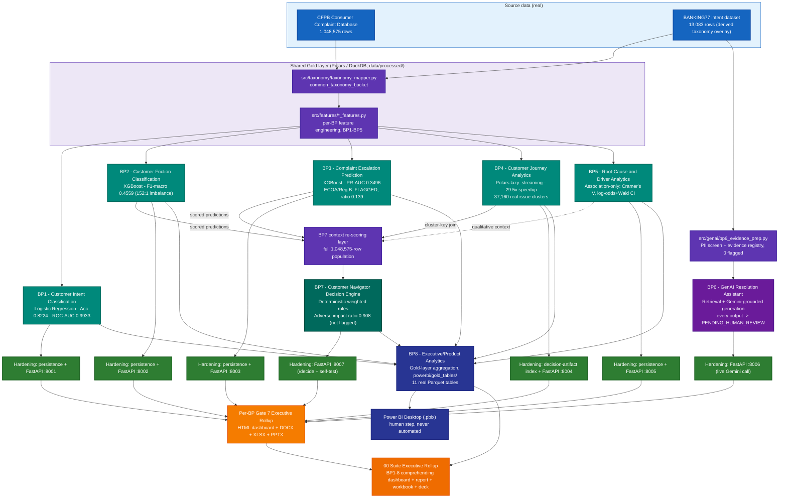

# Customer360 Navigator — Full-Suite System Architecture (BP1–BP8)

Platform-level architecture index for the **entire** Customer360 Navigator Enterprise Suite — all eight
Business Problems, plus the shared Gold layer, the hardening/service layer, and the suite-wide executive
rollup that comprehends all of them. Every BP below is **real-run confirmed end to end** as of 2026-09-26
(BP8 has three gates by design — see its own row below — not seven).

Every diagram and fact in this document is drawn from the real, on-device project state — gate configs,
model bundles, service source, real artifact files — never illustrative or assumed. Where the project
owner has not yet executed a step for real, it is disclosed as such rather than presented as done; nothing
here currently carries that caveat (all 8 BPs are real-run confirmed), but the convention stays in force
for anything added later.

## How to read this set

| Document | Covers |
|---|---|
| `README.md` (this file) | Platform-wide architecture, all 8 BPs, shared infrastructure, cross-cutting governance |
| `bp1_customer_intent_classification_architecture.md` | BP1 full stack |
| `bp2_customer_friction_classification_architecture.md` | BP2 full stack |
| `bp3_complaint_escalation_prediction_architecture.md` | BP3 full stack |
| `bp4_customer_journey_analytics_architecture.md` | BP4 full stack |

Dedicated per-BP architecture documents for BP5–BP8 have not been written yet (only this suite-wide
document covers them so far). Until they exist, each BP's own real design, real numbers, and gate-by-gate
detail live in `notebooks/<bp>/README.md` and `reports/<bp>/MODEL_CARD.md` — both already real and current
for all eight BPs.

## Platform architecture — all 8 Business Problems

**Color key:** blue = source data - purple = shared Gold-layer / evidence-prep processing - teal = the
five predictive/analytical BPs (BP1-BP5) - violet = BP6's GenAI layer - dark teal = BP7's decision engine -
green = the hardening layer (persistence/service/Docker/CI) - indigo = BP8's Power BI Gold-layer
aggregation - orange = executive-rollup output, suite-wide in the darker shade.

## Shared infrastructure (used across the suite)

| Component | Real path | Role |
|---|---|---|
| Project-root resolution | `PROJECT_STRUCTURE_LOCKED.md` marker + `resolve_project_root()` (reimplemented per module) | Every notebook/service/check resolves the project root the same, OS-portable way |
| Performance setup (WARP) | `src/utils/performance_setup.py` | Thread/RAM ceiling configuration (~92% of 8-core/16-thread, 32GB) used by every real notebook run |
| Config sync | `src/utils/bp1_config_sync.py` | Order-independent, idempotent front-matter/gate-block YAML writer, reused by every BP's gate notebooks |
| Taxonomy mapping | `src/taxonomy/taxonomy_mapper.py` | CFPB <-> BANKING77 common-taxonomy-bucket join, shared by BP1/BP2/BP4 |
| Feature engineering | `src/features/bp{1..5}_*_features.py` | Per-BP Gold-layer feature/lineage modules, one per predictive BP |
| GenAI evidence layer | `src/genai/bp6_evidence_prep.py`, `src/genai/bp6_grounded_generation.py` | PII screening + evidence registry, then the retrieval-grounded Gemini call - the only external API call in the suite |
| Decision-engine context | BP7's own Gate 2 re-scoring pass (`model_persistence.py`'s `predict_bp2()`/`predict_bp3()`, BP4 cluster-key join, BP5 qualitative context) | Turns BP2/BP3/BP4/BP5 outputs into one scored population, never re-trains anything |
| Model bundle contract | `src/models/model_persistence.py` (`REQUIRED_KEYS`, `save_model_bundle`, `load_model_bundle`, `predict_bp{1,2,3}`) | Enforced joblib bundle shape per BP, checked on save and load |
| Deployment readiness | `src/deployment/readiness_verdict.py` (BP1-3), `bp4_readiness_verdict.py`, `bp5_readiness_verdict.py`, `bp6_readiness_verdict.py`, `bp7_readiness_verdict.py`, `bp8_readiness_verdict.py` | One standalone sibling per BP; each recomputes hashes, reloads artifacts, and re-runs tests rather than trusting a status flag |
| BP8 Gold-table build | `src/features/bp8_gold_table_builders.py`, `src/features/bp8_gate3_decision_engine_kpi_builders.py` | Aggregates BP1-BP7's own real Gold/artifact outputs into 11 Power BI-ready Parquet tables - no new modeling |
| Reporting | `src/reporting/bp{1..7}_rollup_helpers.py` + `src/reporting/suite_rollup_helpers.py` | Gate 7 Executive Rollup KPI computation + DOCX/XLSX/PPTX/HTML generation per BP, and the suite-wide comprehending rollup |
| CI | `.github/workflows/ci.yml` | `lint` -> `security` (bandit) -> `test` (pytest) -> `notebook-syntax-check` -> `docker-validate`, wired project-wide |

## Cross-cutting governance checks

| Check | Applies to | Real result |
|---|---|---|
| ECOA / Reg B disparate impact (four-fifths rule) | BP3 (first to check), BP7 (re-derived independently) | BP3: adverse impact ratio **0.139**, FLAGGED - investigated, two fairness-aware retrains rejected on the evidence, original model kept and disclosed. BP7: adverse impact ratio **0.908127**, not flagged. Structurally NOT_APPLICABLE for BP1/BP2 (predate the check), BP4 (no demographic-adjacent grouping key), BP6 (no scored population) |
| UDAAP (unfair/deceptive/abusive acts or practices) | BP5, BP6 | BP5's root-cause reporting and BP6's grounded-generation output both run a UDAAP language scanner before anything reaches a human reviewer |
| NIST AI RMF | BP6 | BP6's own risk tier is computed live per generated recommendation (real run: NIST MEDIUM) |
| GLBA | BP6 | Applies because BP6 touches real (if de-identified) consumer complaint narrative text via the Gemini API |

## Production-readiness tiering

`compute_production_recommendation()` (per-BP in `src/reporting/bp{N}_rollup_helpers.py`, suite-wide in
`suite_rollup_helpers.py`) resolves each BP to a tier computed live from that BP's own real Gate 1-6/7
artifacts - never hand-set:

| Tier | Meaning | Reached by |
|---|---|---|
| RECOMMENDED FOR PRODUCTION | All governance checks pass, no unresolved compliance flag | BP1, BP2, BP4, BP6, BP7 |
| CONDITIONAL - GOVERNANCE REVIEW REQUIRED | A real ECOA/Reg B check came back flagged | BP3 only |
| Recommended for Decision-Support Use, With Monitoring | BP5's own distinct tier shape (association-only output, never a scored production model) | BP5 only |
| No production-tier concept | A Gold-layer aggregation build, not a decision model | BP8 |

## BP order and current status (2026-09-26)

| BP | Champion / method | Headline metric | Gates | Production tier |
|---|---|---|---|---|
| BP1 - Customer Intent Classification | Logistic regression (77-class) | Accuracy 0.8224, ROC-AUC 0.9933 | 6 + Gate 7, real-run confirmed | RECOMMENDED FOR PRODUCTION |
| BP2 - Customer Friction Classification | XGBoost | F1-macro 0.4559 (152:1 imbalance) | 6 + Gate 7, real-run confirmed | RECOMMENDED FOR PRODUCTION |
| BP3 - Complaint Escalation Prediction | XGBoost | PR-AUC 0.3496, recall 0.9424 | 6 + Gate 7, real-run confirmed | CONDITIONAL - GOVERNANCE REVIEW REQUIRED |
| BP4 - Customer Journey Analytics | Polars/DuckDB lazy aggregation (no trained model, by design) | 29.5x speedup, 37,160 clusters | 6 + Gate 7, real-run confirmed | RECOMMENDED FOR PRODUCTION |
| BP5 - Root-Cause and Driver Analytics | Association study (Cramer's V, log-odds + Wald CI) | Association-only, never causal | 6 + Gate 7, real-run confirmed | Recommended for Decision-Support Use, With Monitoring |
| BP6 - GenAI Resolution Assistant | Retrieval + Gemini-grounded generation | Retrieval coverage 0.333, 0 PII flagged | 6 + Gate 7, real-run confirmed | RECOMMENDED FOR PRODUCTION (human-gated) |
| BP7 - Customer Navigator Decision Engine | Deterministic weighted-rule engine | Adverse impact ratio 0.908 (not flagged) | 6 + Gate 7, real-run confirmed | RECOMMENDED FOR PRODUCTION |
| BP8 - Executive/Product Analytics | Power BI Gold-layer aggregation | 11 real Gold Parquet tables | Gate 1, 2, 3 (no further gate exists by design) | No production-tier concept (Gold-layer build) |

See each BP's own `notebooks/<bp>/README.md` and `reports/<bp>/MODEL_CARD.md` for the full gate-by-gate
detail behind this table, and the suite-wide dashboard in
`reports/00_suite_executive_rollup/00_suite_executive_rollup_dashboard.html` for the live-computed rollup
of all eight rows at once.
