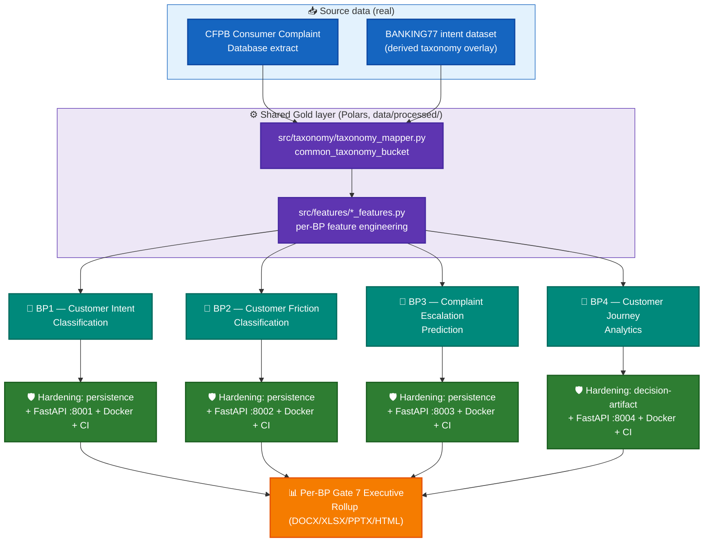

# Customer360 Navigator — System Architecture

Platform-level architecture index for the Customer360 Navigator Enterprise Suite. This document
set covers **BP1 → BP2 → BP3 → BP4** (Customer Intent Classification, Customer Friction
Classification, Complaint Escalation Prediction, Customer Journey Analytics) — the four Business
Problems whose 6-gate governance pipelines and AMEX-RiskIQ-grade hardening passes are complete as
of 2026-09-24. BP5–BP8 are scoped in the Master Plan and are covered separately once their own
pipelines exist (see `docs/master_plan/`).

Every diagram and fact in this document set is drawn from the real, on-device project state —
gate configs, model bundles, service source, Docker/CI files — not illustrative or assumed.
Where a step has not yet been executed for real by the user, it is marked **PENDING REAL RUN**,
never presented as done.

## How to read this set

| Document | Covers |
|---|---|
| `README.md` (this file) | Platform-wide architecture, shared infrastructure, BP ordering |
| `bp1_customer_intent_classification_architecture.md` | BP1 full stack |
| `bp2_customer_friction_classification_architecture.md` | BP2 full stack |
| `bp3_complaint_escalation_prediction_architecture.md` | BP3 full stack |
| `bp4_customer_journey_analytics_architecture.md` | BP4 full stack |

Each per-BP document follows the same shape, in order: **(1)** purpose & scope, **(2)** end-to-end
architecture diagram, **(3)** the 6/7-gate pipeline, **(4)** the hardening layer (persistence →
FastAPI service → Docker → CI), **(5)** current real-run status.

## Platform architecture

All four BPs share one source dataset (real CFPB Consumer Complaint Database extract, plus a
derived BANKING77-taxonomy overlay for BP1/BP2/BP4), one governance lifecycle (the 6-gate pattern,
adapted per BP where the generic gate does not fit — see each BP's own doc), and one hardening
pattern (packaging → persistence → service → Docker → CI) once a BP's gates are real-run
confirmed.

**Color key:** 🔵 blue = source data · 🟣 purple = shared Gold-layer processing · 🟢 teal = the four
Business Problems · 🟩 green = hardening layer (persistence/service/Docker/CI) · 🟠 orange = executive
output.

## Shared infrastructure (used by every BP)

| Component | Real path | Role |
|---|---|---|
| Project-root resolution | `PROJECT_STRUCTURE_LOCKED.md` marker + `resolve_project_root()` (reimplemented per module) | Every notebook/service/check resolves the project root the same, OS-portable way |
| Performance setup (WARP) | `src/utils/performance_setup.py` | Thread/RAM ceiling configuration (~92% of 8-core/16-thread, 32GB) used by every real notebook run |
| Config sync | `src/utils/bp1_config_sync.py` | Order-independent, idempotent front-matter/gate-block YAML writer, reused by every BP's gate notebooks |
| Taxonomy mapping | `src/taxonomy/taxonomy_mapper.py` | CFPB ↔ BANKING77 common-taxonomy-bucket join, shared by BP1/BP2/BP4 |
| Model bundle contract | `src/models/model_persistence.py` (`REQUIRED_KEYS`, `save_model_bundle`, `load_model_bundle`, `predict_bp{1,2,3}`) | Enforced joblib bundle shape per BP, checked on save and load |
| Deployment readiness | `src/deployment/readiness_verdict.py` (BP1–BP3, `SUPPORTED_BPS` registry) and `src/deployment/bp4_readiness_verdict.py` (BP4, standalone — no trained model) | Pure read-only audit of real hardening artifacts, never a subjective verdict |
| Reporting | `src/reporting/bp{1,2,3,4}_rollup_helpers.py` | Gate 7 Executive Rollup KPI computation + DOCX/XLSX/PPTX/HTML generation, including the shared `compute_production_recommendation()` tiering logic |
| CI | `.github/workflows/ci.yml` | `lint` → `security` (bandit) → `test` (pytest) → `notebook-syntax-check` → `docker-validate` (compose config + build-mechanics smoke test), wired for all 4 BPs |

## Production-readiness tiering (shared logic)

`compute_production_recommendation()` (in each `src/reporting/bp{N}_rollup_helpers.py`) resolves
every BP to exactly one of three tiers, computed live from that BP's own real Gate 1–6 artifacts —
never hand-set:

| Tier | Meaning | Reachable by |
|---|---|---|
| 1 — RECOMMENDED FOR PRODUCTION | All governance checks pass, no unresolved compliance flag | All 4 BPs |
| 2 — CONDITIONAL, GOVERNANCE REVIEW REQUIRED | An ECOA/Reg B disparate-impact check exists and is FLAGGED | BP3 only (BP1/BP2 predate the check; BP4 has no demographic-adjacent grouping key) |
| 3 — NOT RECOMMENDED | A structural failure (failed candidate, missing artifact, test failure) | All 4 BPs |

## BP order and current status (2026-09-24)

| BP | 6/7-gate pipeline | Hardening layer | Production tier (real, live-computed) |
|---|---|---|---|
| BP1 — Customer Intent Classification | REAL-RUN CONFIRMED, Gates 1–7 | Delivered as source; persistence notebook **PENDING REAL RUN** | RECOMMENDED FOR PRODUCTION (real, 2026-09-24) |
| BP2 — Customer Friction Classification | REAL-RUN CONFIRMED, Gates 1–7 | Delivered as source; persistence notebook **PENDING REAL RUN** | RECOMMENDED FOR PRODUCTION (real, 2026-09-24) |
| BP3 — Complaint Escalation Prediction | REAL-RUN CONFIRMED, Gates 1–7 | Complete AND real-run confirmed (real joblib bundle on disk) | CONDITIONAL — GOVERNANCE REVIEW REQUIRED (disparate-impact investigated across 3 remediation attempts; governance decision: accept as-is, 2026-09-24) |
| BP4 — Customer Journey Analytics | REAL-RUN CONFIRMED, Gates 1–7 (no trained model, by design) | Complete AND real-run confirmed (real decision-artifact Parquet on disk) | RECOMMENDED FOR PRODUCTION (real, 2026-09-23) |

See each BP's own document for the full detail behind this table.
