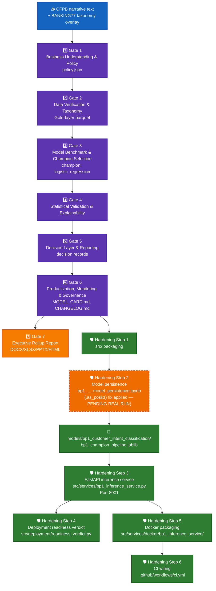

# BP1 — Customer Intent Classification — System Architecture

## 1. Purpose & scope

Classifies inbound customer complaint text into a customer-intent category, using the CFPB
Consumer Complaint Database narrative text joined against a BANKING77-derived intent taxonomy
(`common_taxonomy_bucket`, built by the shared `src/taxonomy/taxonomy_mapper.py` module). Real
champion: **logistic regression** over a text-classification pipeline (selected at Gate 3 on
held-out test accuracy). No ECOA/Reg B disparate-impact check applies to BP1 (introduced starting
at BP3) — confirmed structurally unreachable in `compute_production_recommendation()`.

## 2. End-to-end architecture

**Color key:** 🔵 blue = raw input · 🟣 purple = the 6-gate governance pipeline · 🟠 orange (solid) =
Gate 7 executive rollup · 🟢 green = hardening layer · 🟠 **orange dashed** = the one step still
**PENDING REAL RUN**.

## 3. Gate pipeline (real-run confirmed, 2026-09-22)

| Gate | Name | Real output |
|---|---|---|
| 1 | Business Understanding & Policy | `notebooks/bp1_customer_intent_classification/artifacts/policy.json` |
| 2 | Data Verification & Taxonomy Engineering | Gold-layer parquet, CFPB↔BANKING77 taxonomy join, taxonomy coverage report |
| 3 | Model Benchmark & Champion Selection | `gate3_cv_benchmark_results.csv` — champion **logistic_regression** selected on held-out test accuracy |
| 4 | Statistical Validation & Explainability | SHAP top features, statistical validation JSON |
| 5 | Decision Layer & Reporting | Per-row decision records (top-3 predicted intents + confidence) |
| 6 | Productization, Monitoring & Governance | `MODEL_CARD.md`, `CHANGELOG.md`, `model_inventory_entry.json`, real pytest + notebook-syntax audit run via subprocess |
| 7 | Executive Rollup Report | `reports/bp1_customer_intent_classification/executive_rollup/` (DOCX/XLSX/PPTX/HTML) |

Config: `configs/bp1_customer_intent_classification.yaml`,
status `gate1_confirmed_gate2_confirmed_gate3_confirmed_gate4_confirmed_gate5_confirmed_gate6_confirmed`.

## 4. Hardening layer

### 4.1 Model persistence (Hardening Step 2)

| Field | Value |
|---|---|
| Notebook | `notebooks/bp1_customer_intent_classification/bp1_customer_intent_classification_model_persistence.ipynb` |
| Bundle contract | `src/models/model_persistence.py` → `REQUIRED_KEYS["bp1"]`: `bp_id`, `champion_name`, `pipeline`, `label_encoder`, `class_names`, `metadata` |
| Output path | `models/bp1_customer_intent_classification/bp1_champion_pipeline.joblib` + `bp1_model_metadata.json` |
| YAML-escape fix | Applied — `.as_posix()` on the `joblib_relative_path` config write (fixed 2026-09-24) |
| **Real-run status** | **PENDING** — `models/bp1_customer_intent_classification/` holds only `.gitkeep` as of 2026-09-24 |

### 4.2 FastAPI inference service (Hardening Step 3)

| Route | Method | Purpose |
|---|---|---|
| `/` | GET | Service metadata |
| `/health` | GET | Reports whether the real joblib bundle is loaded |
| `/predict` | POST | Top-3 intent prediction + confidence, `BP1PredictResponse` |

Module: `src/services/bp1_inference_service.py`. Port **8001**. Loads the bundle via
`load_model_bundle()` / `predict_bp1()` from `src/models/model_persistence.py`. Returns `503` when
the real bundle is absent (never a fabricated prediction).

### 4.3 Docker (Hardening Step 5)

`src/services/docker/bp1_inference_service/{Dockerfile, Dockerfile.dockerignore, docker-compose.yml}`
— `python:3.11-slim`, non-root `c360service` user, project-root build context, `HEALTHCHECK` against
`/health`, `EXPOSE 8001`. COPYs the real joblib bundle path — build fails loudly, by design, until
the persistence notebook has actually written one.

### 4.4 CI (Hardening Step 6)

`.github/workflows/ci.yml` → `docker-validate` job validates BP1's compose config and runs a
build-mechanics smoke test against a placeholder (zero-byte) joblib artifact — proves the image
*builds*, never that it serves real predictions.

## 5. Current real status (2026-09-24)

- 6-gate pipeline + Gate 7 rollup: **REAL-RUN CONFIRMED**.
- Production tier: **RECOMMENDED FOR PRODUCTION**, live-computed 2026-09-24 (`executive_rollup_manifest.json`
  `generated_at_utc: 2026-09-24T04:02:03Z`) — Tier 2 is structurally unreachable for BP1.
- Hardening Steps 1, 3, 4, 5, 6: delivered as source, sandbox-verified, full real repo test suite
  passing (248 passed / 32 skipped project-wide, 0 failed).
- Hardening Step 2 (persistence): source delivered and bug-fixed, **not yet real-run** — the one
  open item on BP1. Run `bp1_customer_intent_classification_model_persistence.ipynb` in
  `home_credit_env` to close it.
