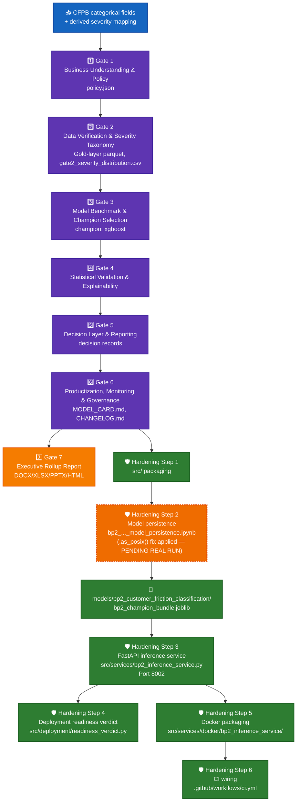

# BP2 — Customer Friction Classification — System Architecture

## 1. Purpose & scope

Classifies each CFPB complaint by customer-friction severity, using company-frequency encoding
plus categorical complaint fields (Product, Issue, Company, etc.) — no free text classifier here
(that is BP1's job). Real champion: **XGBoost** (selected at Gate 3 on held-out test accuracy). No
ECOA/Reg B disparate-impact check applies to BP2 (introduced starting at BP3) — confirmed
structurally unreachable in `compute_production_recommendation()`.

## 2. End-to-end architecture

**Color key:** 🔵 blue = raw input · 🟣 purple = the 6-gate governance pipeline · 🟠 orange (solid) =
Gate 7 executive rollup · 🟢 green = hardening layer · 🟠 **orange dashed** = the one step still
**PENDING REAL RUN**.

## 3. Gate pipeline (real-run confirmed, 2026-09-22)

| Gate | Name | Real output |
|---|---|---|
| 1 | Business Understanding & Policy | `notebooks/bp2_customer_friction_classification/artifacts/policy.json` |
| 2 | Data Verification & Severity Taxonomy | Gold-layer parquet (`src/features/bp2_friction_features.py`), `gate2_severity_distribution.csv` |
| 3 | Model Benchmark & Champion Selection | `gate3_cv_benchmark_results.csv` — champion **xgboost** selected on held-out test accuracy |
| 4 | Statistical Validation & Explainability | SHAP top features, statistical validation JSON |
| 5 | Decision Layer & Reporting | Per-row decision records |
| 6 | Productization, Monitoring & Governance | `MODEL_CARD.md`, `CHANGELOG.md`, `model_inventory_entry.json`, real pytest + notebook-syntax audit run via subprocess |
| 7 | Executive Rollup Report | `reports/bp2_customer_friction_classification/executive_rollup/` (DOCX/XLSX/PPTX/HTML) |

Config: `configs/bp2_customer_friction_classification.yaml`,
status `gate1_confirmed_gate3_confirmed_gate4_confirmed_gate5_confirmed_gate6_confirmed`.

## 4. Hardening layer

### 4.1 Model persistence (Hardening Step 2)

| Field | Value |
|---|---|
| Notebook | `notebooks/bp2_customer_friction_classification/bp2_customer_friction_classification_model_persistence.ipynb` |
| Bundle contract | `src/models/model_persistence.py` → `REQUIRED_KEYS["bp2"]`: `bp_id`, `champion_name`, `preprocessor`, `company_freq_map`, `feature_cols_categorical`, `company_col`, `classifier`, `label_encoder`, `class_names`, `needs_dense`, `metadata` |
| Output path | `models/bp2_customer_friction_classification/bp2_champion_bundle.joblib` + `bp2_model_metadata.json` |
| YAML-escape fix | Applied — `.as_posix()` on the `joblib_relative_path` config write (fixed 2026-09-24) |
| **Real-run status** | **PENDING** — `models/bp2_customer_friction_classification/` holds only `.gitkeep` as of 2026-09-24 |

### 4.2 FastAPI inference service (Hardening Step 3)

| Route | Method | Purpose |
|---|---|---|
| `/` | GET | Service metadata |
| `/health` | GET | Reports whether the real joblib bundle is loaded |
| `/predict` | POST | Friction-severity prediction, `BP2PredictResponse`, with zero-frequency fallback for an unseen company (never fabricated) |

Module: `src/services/bp2_inference_service.py`. Port **8002**. Loads the bundle via
`load_model_bundle()` / `predict_bp2()`. Returns `503` when the real bundle is absent.

### 4.3 Docker (Hardening Step 5)

`src/services/docker/bp2_inference_service/{Dockerfile, Dockerfile.dockerignore, docker-compose.yml}`
— same pattern as BP1 (`python:3.11-slim`, non-root user, `/health` healthcheck), `EXPOSE 8002`.

### 4.4 CI (Hardening Step 6)

`.github/workflows/ci.yml` → `docker-validate` validates BP2's compose config and runs a
build-mechanics smoke test against a placeholder joblib artifact.

## 5. Current real status (2026-09-24)

- 6-gate pipeline + Gate 7 rollup: **REAL-RUN CONFIRMED**.
- Production tier: **RECOMMENDED FOR PRODUCTION**, live-computed 2026-09-24 (`executive_rollup_manifest.json`
  `generated_at_utc: 2026-09-24T04:04:26Z`) — Tier 2 is structurally unreachable for BP2.
- Hardening Steps 1, 3, 4, 5, 6: delivered as source, sandbox-verified, full real repo test suite
  passing (248 passed / 32 skipped project-wide, 0 failed).
- Hardening Step 2 (persistence): source delivered and bug-fixed, **not yet real-run** — the one
  open item on BP2. Run `bp2_customer_friction_classification_model_persistence.ipynb` in
  `home_credit_env` to close it.
