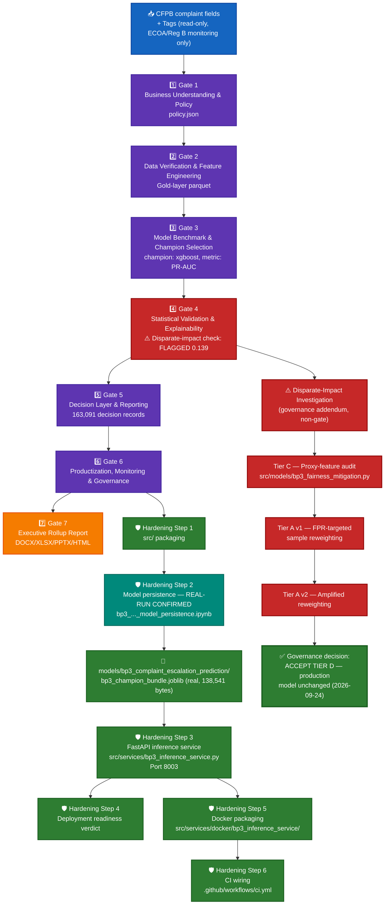

# BP3 — Complaint Escalation Prediction — System Architecture

## 1. Purpose & scope

Predicts whether a CFPB complaint requires escalation/intervention (`intervention_required`, a
real binary 0/1 target already cast in the Gold layer — never label-encoded). Real champion:
**XGBoost**, selected at Gate 3 on **PR-AUC** (`average_precision_score`), never accuracy — this
BP's target is highly imbalanced, so PR-AUC is the correct primary metric, confirmed directly in
Gate 3's own notebook code. This is the first BP in the suite with a live ECOA/Reg B
disparate-impact monitoring check (on the read-only `Tags` passthrough column, never a model
feature).

## 2. End-to-end architecture

**Color key:** 🔵 blue = raw input · 🟣 purple = the 6-gate pipeline · 🔴 **red** = the flagged
disparate-impact finding and its full investigation trail · 🟢 **bold green** = the final governance
decision (accept, documented, production model unchanged) · 🟢 teal = hardening step that is
**REAL-RUN CONFIRMED** · 🟢 green = the rest of the hardening layer · 🟠 orange = Gate 7 rollup.

## 3. Gate pipeline (real-run confirmed, 2026-09-23)

| Gate | Name | Real output |
|---|---|---|
| 1 | Business Understanding & Policy | `notebooks/bp3_complaint_escalation_prediction/artifacts/policy.json` |
| 2 | Data Verification & Feature Engineering | Gold-layer parquet, `src/features/bp3_escalation_features.py` |
| 3 | Model Benchmark & Champion Selection | `gate3_cv_benchmark_results.csv` (5 candidates) — champion **xgboost**, `cv_mean_average_precision=0.3467`, `held_out_test_pr_auc=0.3496` |
| 4 | Statistical Validation & Explainability | Bootstrap CIs, calibration, threshold analysis, SHAP — **disparate-impact FLAGGED**: `adverse_impact_ratio_tags=0.139` (< 0.8 four-fifths rule) |
| 5 | Decision Layer & Reporting | 163,091 real decision records, `predicted_label`/`predicted_probability`, per-row SHAP reason codes, recomputed disparate-impact ratio (0.139, matches Gate 4) |
| 6 | Productization, Monitoring & Governance | `MODEL_CARD.md`/`CHANGELOG.md` carry the flagged finding verbatim into Known Limitations + Ethical Considerations |
| 7 | Executive Rollup Report | `reports/bp3_complaint_escalation_prediction/executive_rollup/` |

Config: `configs/bp3_complaint_escalation_prediction.yaml`,
status `gate1_confirmed_gate3_confirmed_gate4_confirmed_gate5_confirmed_gate6_confirmed`.

## 4. Disparate-impact investigation (governance addendum)

Real per-group finding: FPR (false-positive rate) varies ~7.5× across `Tags` groups (NO_TAG 5.90%
vs. combined Older-American+Servicemember 44.55%) despite comparatively balanced recall — diagnosed
**MODEL-DRIVEN**, not purely prevalence-driven. Module: `src/models/bp3_fairness_mitigation.py`
(diagnostic/disclosure-only, never silently "fixes" a fairness flag).

| Tier | What it checked | Real result |
|---|---|---|
| Tier C — proxy-feature audit | Does any real candidate feature (Product, Sub-product, Issue, Company, etc.) mediate the disparity? | No — max Cramér's V 0.187, residual-model AUC delta −0.00012. Disparity is not a proxy artifact; strengthens the MODEL-DRIVEN diagnosis |
| Tier A v1 — FPR-targeted sample reweighting | Retrain with per-group sample weights | FPR ratio barely moved (0.1324 → 0.1391); real PR-AUC/recall cost; recall-ratio got worse |
| Tier A v2 — amplified reweighting | Square the v1 weight exponent | Same direction, worse: FPR ratio 0.1516 (still far below 0.8), real PR-AUC cost grew ~7×, recall dropped ~13.75 points |
| Governance decision (2026-09-24) | — | **ACCEPT TIER D** — document and govern the finding, production model (original xgboost champion) unchanged |

## 5. Hardening layer

### 5.1 Model persistence (Hardening Step 2) — REAL-RUN CONFIRMED

| Field | Value |
|---|---|
| Notebook | `notebooks/bp3_complaint_escalation_prediction/bp3_complaint_escalation_prediction_model_persistence.ipynb` |
| Bundle contract | `REQUIRED_KEYS["bp3"]`: `bp_id`, `champion_name`, `preprocessor`, `company_freq_map`, `feature_cols_categorical`, `company_col`, `classifier`, `class_names`, `needs_dense`, `metadata` — **no `label_encoder`**, since BP3's target is already binary 0/1 in the Gold layer |
| Output path | `models/bp3_complaint_escalation_prediction/bp3_champion_bundle.joblib` (real, 138,541 bytes) + `bp3_model_metadata.json` |
| **Real-run status** | **CONFIRMED** — real bundle on disk, fidelity-verified (reproduces Gate 5's recorded PR-AUC/recall on reload) |

### 5.2 FastAPI inference service (Hardening Step 3)

| Route | Method | Purpose |
|---|---|---|
| `/` | GET | Service metadata |
| `/health` | GET | Reports whether the real bundle is loaded |
| `/predict` | POST | `intervention_required` prediction + probability, `BP3PredictResponse` |

Module: `src/services/bp3_inference_service.py`. Port **8003**. `test_real_bp3_champion_bundle_serves_predictions`
genuinely runs and passes against the real bundle (verified this session in the cloud sandbox
against a staged copy of the real device file).

### 5.3 Docker (Hardening Step 5)

`src/services/docker/bp3_inference_service/{Dockerfile, Dockerfile.dockerignore, docker-compose.yml}`
— `EXPOSE 8003`; header comments document the real polars/PyYAML transitive dependency (pulled in
via `src/features/bp3_escalation_features.py` and `src/taxonomy/taxonomy_mapper.py`), unlike
BP1/BP2's simpler dependency set.

### 5.4 CI (Hardening Step 6)

`.github/workflows/ci.yml` → `docker-validate` validates BP3's compose config and runs a
build-mechanics smoke test against a placeholder joblib artifact.

## 6. Current real status (2026-09-24)

- 6-gate pipeline + Gate 7 rollup: **REAL-RUN CONFIRMED**.
- Disparate-impact investigation: **CLOSED** — governance decision ACCEPT TIER D, real-run confirmed
  at every tier (investigation, Tier C, Tier A v1, Tier A v2).
- Production tier: **CONDITIONAL — GOVERNANCE REVIEW REQUIRED** (Tier 2), the honest, live-computed
  final tier given the accepted disparate-impact finding — this is BP3's genuine final status, not
  a placeholder.
- Hardening Steps 1–6: **all complete and real-run confirmed** — the only BP1–BP4 hardening pass
  with the persistence step already closed by a real run.
