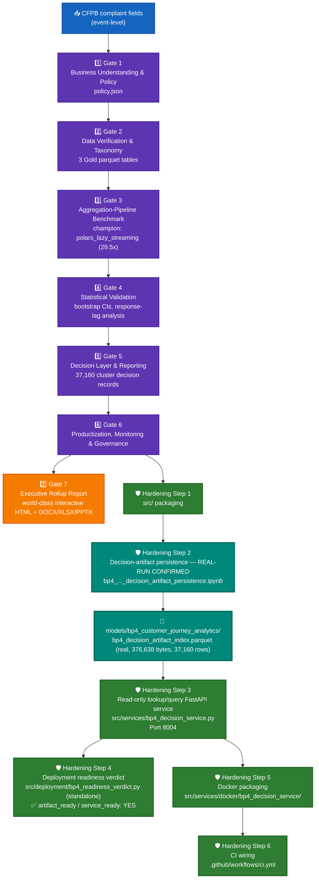

# BP4 — Customer Journey Analytics — System Architecture

## 1. Purpose & scope

Aggregates CFPB complaints into per-issue-cluster "journeys" (keyed by the real, disclosed
`(Company, Product, Sub-product, Issue, Sub-issue)` combination — there is no customer/consumer
identifier in this real extract) and produces a deterministic, transparent review-priority
rollup. **BP4 fits no supervised model, by explicit design** (confirmed in its own
`MODEL_CARD.md`, SR 11-7 model-inventory touchpoint stated `NOT_APPLICABLE`). Its "champion" is an
**execution-engine benchmark**: 5 aggregation-pipeline candidates were speed-benchmarked at Gate 3,
and **`polars_lazy_streaming`** won (0.103927s vs. pandas_groupby's 3.067079s baseline, a real
~29.5× speedup). ECOA/Reg B disparate-impact monitoring is real-confirmed **NOT_APPLICABLE** — no
demographic-adjacent field exists in any BP4 grouping key.

## 2. End-to-end architecture

**Color key:** 🔵 blue = raw input · 🟣 purple = the 6-gate pipeline (adapted for BP4's no-model
design) · 🟠 orange = Gate 7 rollup · 🟢 teal (bold) = the persistence step and its artifact,
**REAL-RUN CONFIRMED** · 🟢 green = the rest of the hardening layer.

## 3. Gate pipeline (real-run confirmed, 2026-09-23)

| Gate | Name (BP4-adapted per Master Plan Section 8/17.5) | Real output |
|---|---|---|
| 1 | Business Understanding & Policy | `policy.json` — real 1,048,575-row schema check, no customer identifier confirmed |
| 2 | Data Verification & Taxonomy | 3 Gold parquet tables: `cfpb_journey_event_gold`, `cfpb_issue_cluster_monthly_gold`, `cfpb_issue_cluster_summary_gold` (37,160 clusters, 41.85% recurring) |
| 3 | Aggregation-Pipeline Benchmark & Champion Selection | 5 candidates benchmarked; champion **polars_lazy_streaming**, 0.103927s (29.5× vs. pandas baseline) |
| 4 | Statistical Validation | Bootstrap CIs (1,000 resamples): mean `response_lag_days`=0.4652, `recurring_cluster_rate`=41.85% — real finding: BANKING77-in-scope rows have 1.3768 days longer response lag (95% CI entirely positive) |
| 5 | Decision Layer & Reporting | 37,160 real per-cluster decision records — `review_priority_score` (0-3, sum of 3 grounded boolean flags), `review_priority_tier` (HIGH/MEDIUM/LOW/NONE), reason codes |
| 6 | Productization, Monitoring & Governance | `MODEL_CARD.md` documents a real deterministic pipeline (never a trained model); real pytest (219 passed) + notebook-syntax audit (34/34) run via subprocess |
| 7 | Executive Rollup Report | `reports/bp4_customer_journey_analytics/executive_rollup/` — interactive HTML dashboard with tier filter/search/sort/pagination over all 7,204 real HIGH+MEDIUM clusters |

Config: `configs/bp4_customer_journey_analytics.yaml`, status `gate6_complete`.

Real tier rollup: HIGH=2,284 clusters (94,410 rows) · MEDIUM=4,920 clusters (906,612 rows, 86.4%
of all rows) · LOW=12,033 clusters (29,630 rows) · NONE=17,923 clusters (17,923 rows, singleton).

## 4. Hardening layer

### 4.1 Decision-artifact persistence (Hardening Step 2) — REAL-RUN CONFIRMED 2026-09-24

BP4 has no joblib model bundle to persist — it persists Gate 5's decision-records CSV into a
typed, sorted Parquet **index** instead, and serves it read-only.

| Field | Value |
|---|---|
| Notebook | `notebooks/bp4_customer_journey_analytics/bp4_customer_journey_analytics_decision_artifact_persistence.ipynb` |
| Output | `models/bp4_customer_journey_analytics/bp4_decision_artifact_index.parquet` (real, 376,638 bytes, sha256 `561f28b5c0...321f`) + `bp4_decision_artifact_metadata.json` |
| Sort/index key | `['Company', 'Product', 'Sub-product', 'Issue', 'Sub-issue']` (`CLUSTER_KEY`) |
| Integrity | Full value-for-value round-trip verified across all 37,160 rows × 19 columns (0 mismatches); idempotent re-write byte-identical |
| YAML-escape fix | Applied — `.as_posix()` on `parquet_relative_path` (fixed 2026-09-24, confirmed correct on the real run: forward slashes in the written config) |
| **Real-run status** | **CONFIRMED** 2026-09-24, independently verified — sha256 of the real on-device parquet cross-checked byte-for-byte |

### 4.2 FastAPI lookup/query service (Hardening Step 3)

| Route | Method | Purpose |
|---|---|---|
| `/` | GET | Service metadata (CLUSTER_KEY, tiers) |
| `/health` | GET | Reports whether the real Parquet artifact is loaded |
| `/cluster/lookup` | GET | Exact-key lookup, one cluster record |
| `/clusters` | GET | Filtered/paginated list (tier, company, recurring-only) |
| `/clusters/tiers/{tier}` | GET | List by tier path segment |

**Never `/predict`** — BP4 serves lookups over real, already-computed records, never a live
prediction (it fits no model). Module: `src/services/bp4_decision_service.py`. Port **8004**.
Deliberately standalone (does not import `src/services/service_common.py`).

### 4.3 Deployment readiness (Hardening Step 4)

Standalone module `src/deployment/bp4_readiness_verdict.py` (not an extension of the shared
`readiness_verdict.py` — BP4's Parquet-index shape doesn't fit that module's joblib-bundle design).
Independently re-run this session against the real staged artifact:
**`artifact_ready: YES`, `service_ready: YES`**, all substantive checks PASS, service's own 18/18
unit tests pass.

### 4.4 Docker (Hardening Step 5)

`src/services/docker/bp4_decision_service/{Dockerfile, Dockerfile.dockerignore, docker-compose.yml}`
— `EXPOSE 8004`, COPYs the real Parquet index (not a joblib bundle); only polars/fastapi/pydantic
needed (grep-verified against the service's own imports — no pandas/pyarrow/joblib/sklearn).

### 4.5 CI (Hardening Step 6)

`.github/workflows/ci.yml` → `docker-validate` validates BP4's compose config and runs a
build-mechanics smoke test against placeholder Parquet/JSON artifacts.

## 5. Current real status (2026-09-24)

- 6-gate pipeline + Gate 7 rollup: **REAL-RUN CONFIRMED** end to end.
- Production tier: **RECOMMENDED FOR PRODUCTION** (Tier 1) — Tier 2 is structurally unreachable for
  BP4 (no disparate-impact check exists; ECOA/Reg B real-confirmed NOT_APPLICABLE).
- Hardening Steps 1–6: **all complete and real-run confirmed**, including the persistence step
  (closed today) and its readiness-verdict re-verification against the real artifact.
