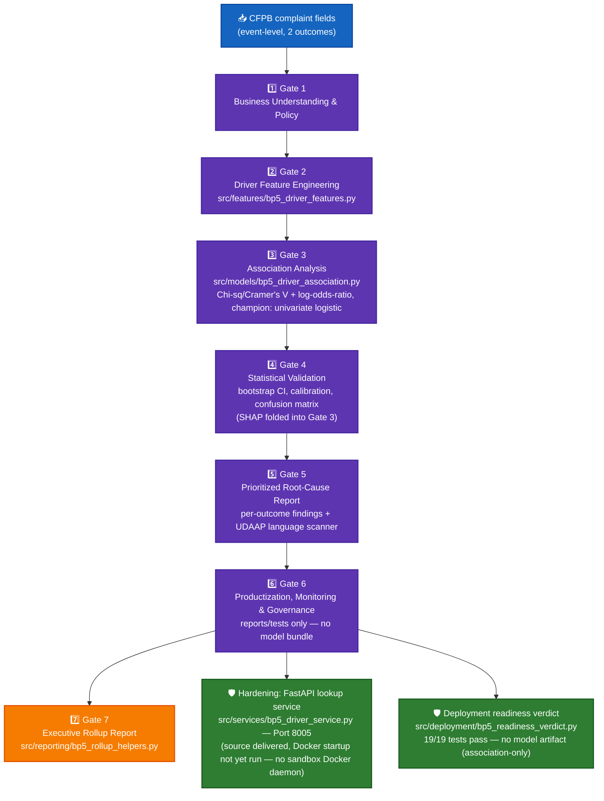

# BP5 — Root Cause Driver Analytics — System Architecture

## 1. Purpose & scope

Identifies which real CFPB complaint fields are statistically associated with two outcomes —
`outcome_1_intervention_required` (reused, unchanged, from BP3's own real target) and
`outcome_2_timely_response_failure` (new) — using **association analysis, never a causal or
predictive claim**. Chi-square/Cramer's V screening plus closed-form log-odds-ratio with Wald
confidence intervals (independently cross-checked against `statsmodels`), with a univariate
logistic model as the reporting champion. ECOA/Reg B disparate-impact monitoring is real-confirmed
**NOT_APPLICABLE** for BP5 itself (no BP5-owned demographic-adjacent grouping key); UDAAP applies,
and BP5's own Gate 5 runs a UDAAP-language scanner over every generated finding sentence (two real
scanner bugs — quote-masking and per-sentence scope — found and fixed on this BP; the fixed pattern
was later reused by BP6's Gate 5).

## 2. End-to-end architecture

**Color key:** 🔵 blue = raw input · 🟣 purple = the 6-gate pipeline · 🟠 orange = Gate 7 rollup ·
🟢 green = hardening layer.

## 3. Gate pipeline (real-run confirmed end to end)

| Gate | Name | Real output |
|---|---|---|
| 1 | Business Understanding & Policy | `policy.json` — both outcomes scoped, ECOA/Reg B NOT_APPLICABLE, UDAAP applies |
| 2 | Driver Feature Engineering | `src/features/bp5_driver_features.py` |
| 3 | Association Analysis & Champion Selection | Chi-square/Cramer's V screening + closed-form log-odds-ratio/Wald CI (cross-checked vs `statsmodels`); champion: univariate logistic |
| 4 | Statistical Validation | Bootstrap CI, calibration curve, confusion matrix (SHAP folded into Gate 3, not a separate step) |
| 5 | Prioritized Root-Cause Report | Per-outcome findings report, UDAAP-language scanner (2 real bugs found+fixed: quote-masking, per-sentence scope) |
| 6 | Productization, Monitoring & Governance | Reports/tests only — **no model bundle** (association analysis produces no artifact to persist) |
| 7 | Executive Rollup Report | `src/reporting/bp5_rollup_helpers.py` — dashboard 79,564B / DOCX 364,891B / XLSX 18,840B / PPTX 367,762B |

Real pytest: **325 passed / 3 skipped**. Production tier: **Recommended for Decision-Support Use,
With Monitoring** (Tier 2) — BP5 is explicitly qualified, not an unconditional production
recommendation, and its own dashboard/report language says so.

## 4. Hardening layer

### 4.1 FastAPI lookup service

`src/services/bp5_driver_service.py`, port **8005**. Source delivered and unit-tested; the
Docker build and a real container startup have **not** been run in this environment (no sandbox
Docker daemon available) — disclosed here rather than implied complete.

### 4.2 Deployment readiness verdict

Standalone module `src/deployment/bp5_readiness_verdict.py` (reimplements its own
`resolve_project_root()`, never imports another BP's sibling module). **19/19 tests pass.** Checks
are necessarily narrower than BP1-4's joblib-bundle checks — BP5 has no model artifact to verify
(association analysis, not a trained model), so its readiness verdict is scoped to the report and
service-wiring surface only.

## 5. Current real status

- 6-gate pipeline + Gate 7 rollup: **REAL-RUN CONFIRMED** end to end.
- Production tier: **Recommended for Decision-Support Use, With Monitoring** (Tier 2 — genuinely
  reached, not structurally unreachable like BP4/BP6).
- Hardening: FastAPI service source complete; Docker build/startup and deployment-readiness
  verdict complete and passing; **not yet containerized/run for real** in this environment.
