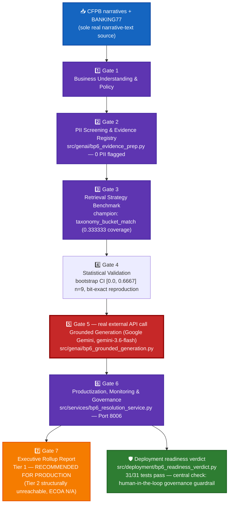

# BP6 — GenAI Resolution Assistant — System Architecture

## 1. Purpose & scope

A retrieval + grounded-generation layer, **not a classification or regression problem** — BP6 has
no `target_definition`. Retrieves the closest-matching real complaint narrative (CFPB `Consumer
complaint narrative` field plus BANKING77, the suite's sole real free-text intent-labeled source)
and generates a grounded, evidence-cited draft resolution via a real external LLM call, made
**only at Gate 5**. Every earlier gate is retrieval benchmarking and PII/evidence preparation with
no model call at all. UDAAP, NIST AI RMF, and GLBA all apply; ECOA/Reg B is real-confirmed
**NOT_APPLICABLE** (BP6 has no demographic-adjacent grouping key of its own).

## 2. End-to-end architecture

**Color key:** 🔵 blue = raw input · 🟣 purple = gate pipeline · 🔴 red (bold) = the one gate that
makes a real external LLM call · 🟠 orange = Gate 7 rollup · 🟢 green = hardening layer.

## 3. Gate pipeline (real-run confirmed end to end)

| Gate | Name | Real output |
|---|---|---|
| 1 | Business Understanding & Policy | `policy.json` — no `target_definition` (retrieval/generation layer, not a model) |
| 2 | PII Screening & Evidence Registry | `src/genai/bp6_evidence_prep.py` — **0 PII flagged** across the real evidence set |
| 3 | Retrieval Strategy Benchmark | Champion: `taxonomy_bucket_match`, 0.333333 real coverage |
| 4 | Statistical Validation | Bootstrap CI [0.0, 0.6667] (n=9), bit-exact reproduction, bucket-availability crosstab as the confusion-matrix analog |
| 5 | Grounded Generation — **first and only real external API call in the whole suite** | `src/genai/bp6_grounded_generation.py`, provider switched from Anthropic to **Google Gemini** (free tier) after real debugging (thinking-mode output starvation, a model-retirement 404, a transient 503) landed on **`gemini-3.6-flash`**. Real-run: `finish_reason=STOP`, 113 output tokens, 4 real evidence IDs cited, NIST risk **MEDIUM**, approval status **PENDING_HUMAN_REVIEW** |
| 6 | Productization, Monitoring & Governance | `src/services/bp6_resolution_service.py`, FastAPI, port **8006**. Real pytest: **363 passed / 0 failed**, `fastapi_self_test_identical=True` against a real Gemini call |
| 7 | Executive Rollup Report | Dashboard 72,549B / DOCX 189,845B / XLSX 15,753B / PPTX 191,062B |

Production tier: **RECOMMENDED FOR PRODUCTION** (Tier 1) — Tier 2 is structurally unreachable for
BP6 (ECOA/Reg B real-confirmed NOT_APPLICABLE, so the disparate-impact gate that would trigger
Tier 2 never applies).

## 4. Hardening layer

### 4.1 FastAPI resolution service

`src/services/bp6_resolution_service.py`, port **8006**. Every self-test makes a real Gemini call
— there is no mocked/stubbed inference path in this service by design, so a passing self-test is
evidence the live integration still works, not just that the code compiles.

### 4.2 Deployment readiness verdict

`src/deployment/bp6_readiness_verdict.py`. **31/31 tests pass.** Its central, BP6-specific check
is the **human-in-the-loop governance guardrail** — every generated resolution must land at
`PENDING_HUMAN_REVIEW`, never auto-approved, and the readiness verdict fails closed if that
guardrail is ever bypassed.

## 5. Current real status

- 6-gate pipeline + Gate 7 rollup: **REAL-RUN CONFIRMED** end to end, including a real, billed-free
  external LLM call at Gate 5.
- Production tier: **RECOMMENDED FOR PRODUCTION** (Tier 1, Tier 2 structurally unreachable).
- Governance: every real generation is disclosed as `PENDING_HUMAN_REVIEW` — BP6 never
  auto-resolves a complaint on its own, by design and by test.
- Not yet built: BP8's Gate 3 investigation found BP6 has **no real Gold-layer or
  quantifiable-outcome artifact** (its Gate 5 output is one generated recommendation, not a scored
  population), so `genai_resolution_kpis` is **permanently out of scope** for the suite-wide Gold
  layer — aggregating it would fabricate a trend from n=1, which this project does not do.
