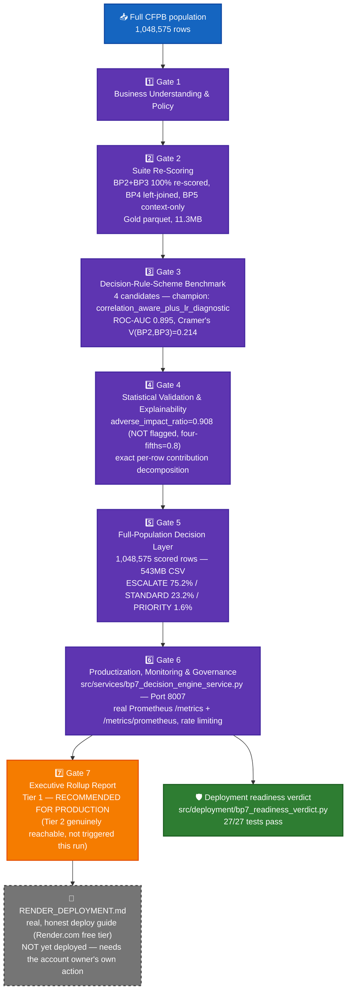

# BP7 — Customer Navigator Decision Engine — System Architecture

## 1. Purpose & scope

A **deterministic, transparent weighted-rule layer** — not a trained classifier and not a GenAI
call — that combines BP2's friction prediction, BP3's escalation prediction, and BP4's journey
cluster tier into one `priority_score` / `intervention_flag` / `recommended_action` / reason-code
record per complaint, at full population scale (1,048,575 real rows). BP7 represents the suite's
full value chain end to end (BP2 → BP3 → BP4 context → BP7 decision → API). ECOA/Reg B is
**applicable and real-checked** here (unlike BP4/BP6) — BP7 carries forward BP3's own real
disparate-impact finding and resolves it for real at Gate 4.

## 2. End-to-end architecture

**Color key:** 🔵 blue = raw input · 🟣 purple = gate pipeline · 🟠 orange = Gate 7 rollup ·
🟢 green = hardening layer · ⚪ grey dashed = real, prepared, but **not yet executed** (deployment).

## 3. Gate pipeline (real-run confirmed end to end)

| Gate | Name | Real output |
|---|---|---|
| 1 | Business Understanding & Policy | `policy.json` — real-run confirmed |
| 2 | Suite Re-Scoring | BP2/BP3 100% re-scored via `model_persistence.py`; BP4 left-joined (1,022,746 matched / 25,829 unscored); BP1 not re-scored (structurally impossible — taxonomy crosswalk context only); BP5 qualitative context-only. Gold parquet: `data/processed/cfpb_decision_engine_context_gold.parquet` (11,309,052 bytes) |
| 3 | Decision-Rule-Scheme Benchmark | 4 real weighting schemes benchmarked; champion **`correlation_aware_plus_lr_diagnostic`** — weights bp2=0.222714 / bp3=0.170774 / bp4=0.606512; real redundancy finding Cramer's V(BP2,BP3)=0.2144; held-out LR ROC-AUC=0.895153 |
| 4 | Statistical Validation & Explainability | `adverse_impact_ratio=0.908127` (**not flagged**, four-fifths threshold 0.8); `intervention_flag_rate=0.768415` CI[0.767609, 0.769243]; exact per-row contribution decomposition (genuinely exact, not an approximation) |
| 5 | Full-Population Decision Layer | 1,048,575 scored rows; `recommended_action` breakdown: **ESCALATE_ROOT_CAUSE_REVIEW_RECURRING_CLUSTER 75.24%** / STANDARD_QUEUE 23.16% / PRIORITY_QUEUE_REVIEW 1.60% (sums to 100%) |
| 6 | Productization, Monitoring & Governance | `src/services/bp7_decision_engine_service.py`, port **8007**, `GET /decide/{complaint_id}`, real Prometheus `/metrics` + `/metrics/prometheus` (own `CollectorRegistry`, never the library default), rate limiting. Real pytest: **410 passed / 0 failed / 3 skipped** |
| 7 | Executive Rollup Report | Dashboard 80,266B / DOCX 329,187B / XLSX 19,300B / PPTX 331,472B; `tier_code=1`, `flagged_four_fifths_rule=False` |

## 4. Hardening layer

### 4.1 FastAPI decision service

Read-only lookup over the real, persisted `gate5_full_population_decision_records.csv`
(~543MB, baked into the Docker image at build time — never staged into a notebook or a downstream
gate directly, only its summary/breakdown artifacts are). Makes **zero external network calls** of
its own — unlike BP6, BP7's self-test is an honest internal-consistency proof, not a live
third-party call.

### 4.2 Deployment readiness verdict

`src/deployment/bp7_readiness_verdict.py`. **27/27 tests pass**, including a bespoke static
wiring-check for `/decide` + self-test rather than invoking the service live.

### 4.3 Real, prepared (not yet executed) public deployment

`RENDER_DEPLOYMENT.md` is a real, fact-checked deployment guide (Render.com free tier, confirmed
against Render's own published terms as of September 2026) for exactly this service and its
already-committed Dockerfile. It states plainly that account creation and the actual "Deploy"
click are outside Claude's execution boundary — this is disclosed as a prepared, real, runnable
plan, **not** a live endpoint. As of this document, **no BP1-7 service has been run behind a live
public endpoint.**

## 5. Current real status

- All 7 gates: **REAL-RUN CONFIRMED** end to end — the only BP in the suite with every gate,
  including Gate 7, real-run confirmed on the same pass.
- Production tier: **RECOMMENDED FOR PRODUCTION** (Tier 1); Tier 2 is genuinely reachable for BP7
  (unlike BP4/BP6) but was not triggered on this real run (`flagged_four_fifths_rule=False`).
- Represents the suite's full demonstrable value chain (BP2 → BP3 → BP4 context → BP7 → API) and
  is the recommended single service to deploy first if/when a live public endpoint is added.
