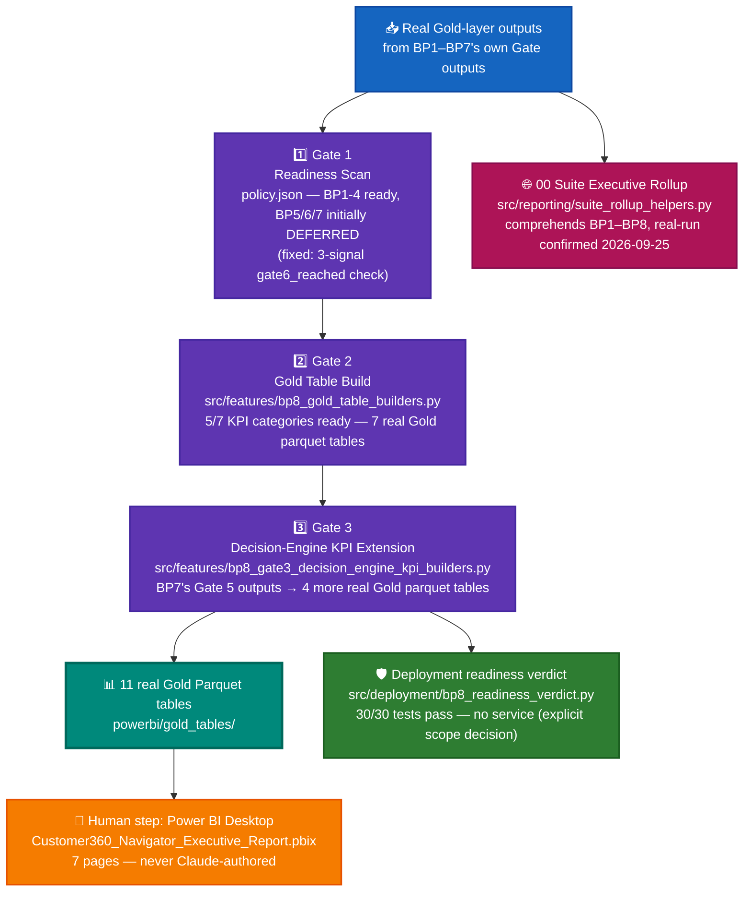

# BP8 — Executive & Product Analytics — System Architecture

## 1. Purpose & scope

Aggregates the **real Gold-layer outputs already produced by BP1-7** into a Power BI-ready
semantic layer — **explicitly never "a ninth modeling problem"**: no predictive target, no
classifier, no GenAI call of its own. Its only outputs are governed Gold Parquet tables and the
suite-wide executive rollup; the interactive `.pbix` itself is an explicit **human, Power BI
Desktop step**, never a Claude deliverable (Master Plan Section 19).

## 2. End-to-end architecture

**Color key:** 🔵 blue = raw input (other BPs' real Gold outputs) · 🟣 purple = BP8's own 3 gates ·
🟢 teal (bold) = the real, on-disk Gold table set · 🟠 orange = the one deliberately human,
non-Claude step · 🩷 pink = the suite-wide rollup that reads all 8 BPs · 🟢 green = hardening layer.

## 3. Gate pipeline (all 3 real gates real-run confirmed)

| Gate | Name | Real output |
|---|---|---|
| 1 | Readiness Scan | `policy.json` — real-run 2026-09-24. Found BP1-4 ready (friction_trends, escalation_trends, product_opportunity_flags, customer_intent_and_volume); BP5/6/7 initially **DEFERRED** by a buggy substring-only `gate6_reached` check |
| 2 | Gold Table Build | `src/features/bp8_gold_table_builders.py`. Real-run 2026-09-25: **5/7 KPI categories ready** (up from 4 — fixed the Gate 1 check to a 3-signal test, which correctly resolved BP5-7 as `gate6_reached=True`). **7 real Gold Parquet tables**: `friction_trends` (700 rows), `escalation_trends` (521), `product_opportunity_flags` (37,160), `customer_intent_taxonomy_trends` (262), `customer_intent_banking77_categories` (154), `root_cause_outcome_trends` (660), `root_cause_field_driver_ranking` (10) |
| 3 | Decision-Engine KPI Extension | `src/features/bp8_gate3_decision_engine_kpi_builders.py`. Real-run 2026-09-25T08:51:00Z: reformats BP7's own real Gate 5 population-scale outputs (never recomputed) into **4 more real Gold Parquet tables**: `decision_engine_action_breakdown` (3 rows), `decision_engine_tier_crosstab` (8 rows), `decision_engine_disparate_impact` (4 rows), `decision_engine_summary` (1 row) |

**Total: 11 real Gold Parquet tables** in `powerbi/gold_tables/` (7 from Gate 2 + 4 from Gate 3).
BP8 has no Gates 4-7 by design — Section 19 of the Master Plan names no further Claude-authored
gate beyond the Gold-table build; those steps are **honestly PENDING**, not silently skipped.

**Explicit, disclosed scope decision:** `genai_resolution_kpis` (BP6) is **permanently out of
scope** for this Gold layer. BP6's real Gate 5 output is a single generated recommendation
(n=1), not a scored population — there is no real trend or volume to aggregate, and fabricating
one would violate this project's zero-fabrication rule. This was decided by investigating BP6's
real artifacts, not assumed, and disclosed directly rather than silently building nothing.

## 4. The suite-wide 00 Executive Rollup

`src/reporting/suite_rollup_helpers.py` + `src/reporting/templates/00_suite_dashboard_template.html`
reads all 8 BPs' own real manifests (never recomputes a BP's own result) and renders the one
dashboard that comprehends the whole suite — 5 BPs Recommended for Production, 1 Conditional, 1
Decision-Support tier, 7/7 BP1-7 with a completed Gate 7 rollup, 157 pytest passed (summed over
BP1+BP2's readable Gate 6 blocks), 1,048,575 records (BP7). **Real-run confirmed 2026-09-25.**

## 5. Hardening layer

`src/deployment/bp8_readiness_verdict.py`. **30/30 tests pass.** BP8 has **no FastAPI service at
all** — an explicit scope decision (BP8 is a Gold-table/aggregation layer, not a queryable
production endpoint), so its readiness verdict checks the Gold-table build and manifest surface
only, never a service.

## 6. Current real status

- Gates 1-3: **all REAL-RUN CONFIRMED**. Gates 4-7: honestly not applicable/not built (Section 19
  scope, disclosed above).
- 11 real Gold Parquet tables on disk, all with real, independently-verified row counts.
- The interactive `.pbix` (7-page executive report) is built as the intended human step, over
  these same 11 real Gold tables — no synthetic data anywhere in that model.
- `genai_resolution_kpis` is documented as permanently out of scope, not a gap to be filled later.
